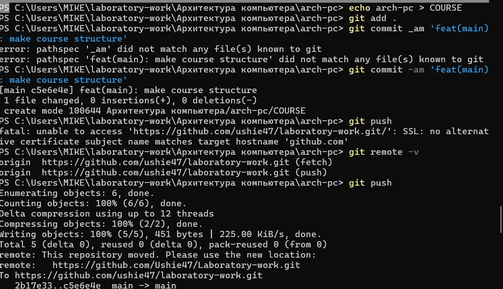

#  **Лаборатору Отчет No2**

**ДЭВИД МАЙКЛ ФРАНСИС**

**Лаб 03**

## Цель работы
**Цель этой лабораторной работы - узнать, как составить отчет о уценке**

## **Описание задачи**
1. **Сначала Я создали репозиторий на github, а затем
клонировали его в наш терминал с помощью команды** [github](git clone https://github.com/username/respository.git)

2. **Затем Я сделал предварительную настройку git**

3. **Я сгенерировал пару ключей (приватный и публичный),которая используется для последующей идентификации
пользователя на сервере репозитория с помощью
команды (ssh-keygen -C "David Michael Francis<omotole47@gmail.com>")**

4. **Затем я загрузил публичный ключ на github. Я вручнуюзашел в директорию ~/.shh, скопировал ее и загрузил на GitHub. Это показывает, что он был загружен**

5. **Затем я создал каталог с именем «Архитектурныйкомпьютер» с подкаталогами (arch pc/labs/labs01/labs02) с помощью команды mkdir "arch-pc" mkdir -p ~/laboratory-work/"Архитектура компьютера" mkdir "labs/labs02/report"**

6. **Затем я создал необходимую директорию с помощью кода (echo arch-pc > COURSE), а затем загрузил файлы на сервер с помощью команды ("git add ." "git commit -am 'feat(main): создание структурыкурса' " "git push")**

**Вывод: Из этой лабораторной работы я узнал, как создать репозиторий и клонировать его на свой командный терминал, а также сгенерировать ключдля входа в репозиторий. Наконец-то я узнал, как загрузить проделанную работу на github.**

