# **Лаборатору Отчет No6**

**ДЭВИД МАЙКЛ ФРАНСИС**

# Цель работы

Цель данной лабораторной работы - освоение арифметческих инструкций языка 
ассемблера NASM.

# Выполнение лабораторной работы

## Символьные и численные данные в NASM

С помощью утилиты mkdir создаю директорию, в которой буду создавать файлы 
с программами для лабораторной работы №6. Перехожу в созданный каталог с 
помощью утилиты cd.

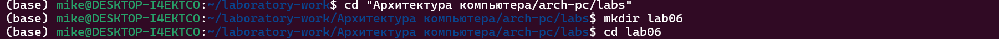

С помощью утилиты touch создаю файл lab6-1.asm

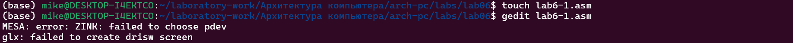

Открываю созданный файл lab7-1.asm, вставляю в него программу вывода 
значения регистра eax

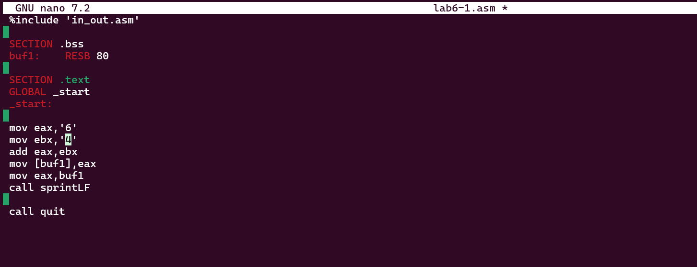

Создаю исполняемый файл программы и запускаю его. Вывод программы: символ j, потому что программа вывела символ, соответствующий по системе 
ASCII сумме двоичных кодов символов 4 и 6 

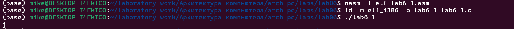

Изменяю в тексте программы символы "6" и "4" на цифры 6 и 4

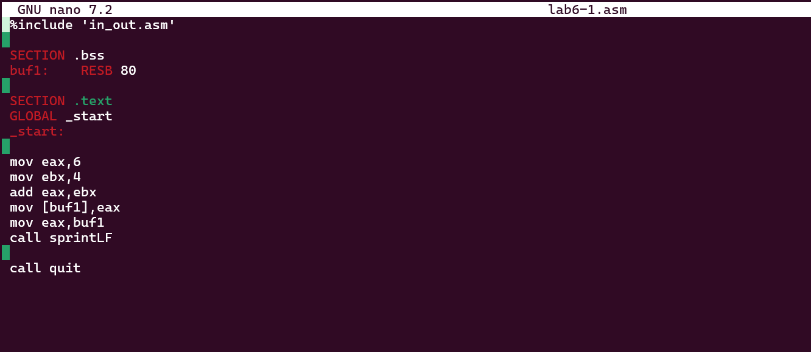

Создаю новый исполняемый файл программы и запускаю его. Теперь вывелся символ с кодом 10, это символ перевода строки, этот символ не отображается при выводе на экра

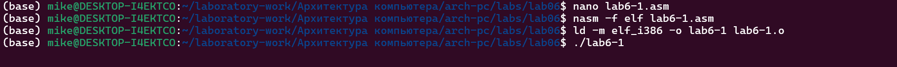

Создаю новый файл lab6-2.asm с помощью утилиты touch.Ввожу в файл текст другойпрограммы для вывода значения регистра eax

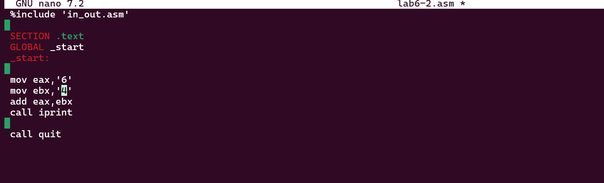

Создаю и запускаю исполняемый файл lab6-2.. Теперь вывод число 106, потому что программа позволяет вывести именно число, а не символ, хотя все еще происходит именно сложение кодов символов "6" и "4

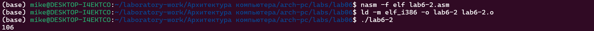

Заменяю в тексте программы в файле lab6-2.asm символы "6" и "4" на числа 6 и 4

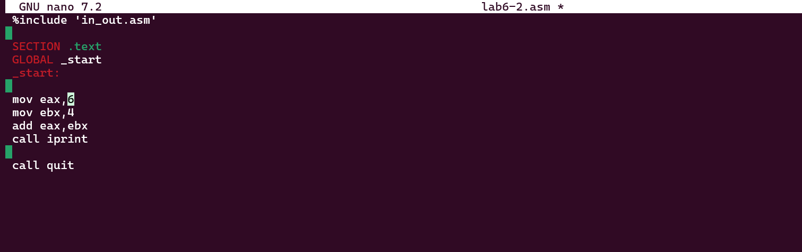

Создаю и запускаю новый исполняемый файл. Теперь программа складывает не соответствующие символам коды в системе ASCII, а сами числа, поэтому вывод 10

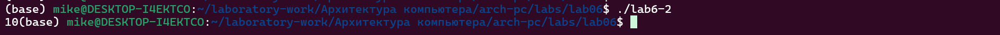

## Выполнение арифметических операций в NASM

Создаю файл lab6-3.asm с помощью утилиты touch.Ввожу в созданный файл текст программы для вычисления значения выражения f(x) = (5 * 2 + 3)/3

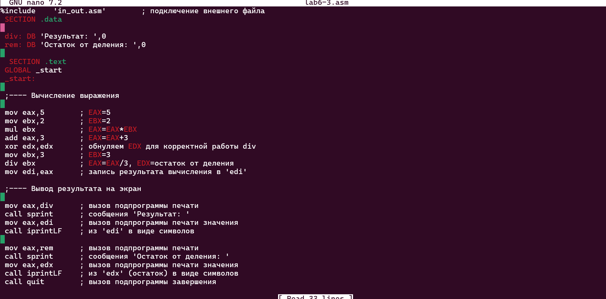

Создаю исполняемый файл и запускаю его

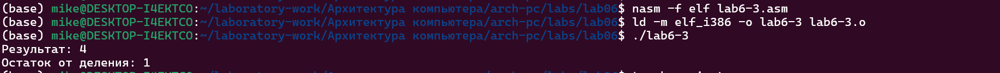

Создаю файл variant.asm с помощью  утилиты touch.Ввожу в файл текст программы для вычисления варианта задания по номеру студенческого билета

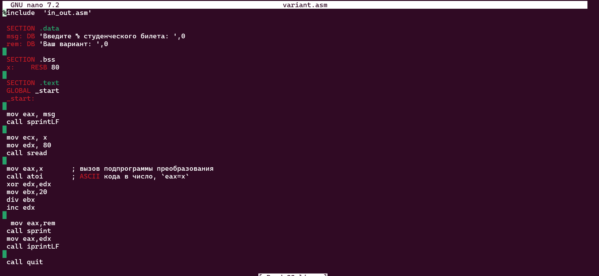

Создаю и запускаю исполняемый файл.. Ввожу номер своего студ. билета с клавиатуры, программа вывела, что мой вариант - 4

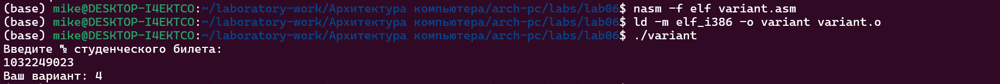

### Ответы на вопросы по программе

1. За вывод сообщения "Ваш вариант" отвечают строки кода:

```NASM
mov eax,rem
call sprint
```

2. Инструкция mov ecx, x используется, чтобы положить адрес вводимой строки x в регистр ecx
mov edx, 80 - запись в регистр edx длины вводимой строки 
call sread - вызов подпрограммы из внешнего файла, обеспечивающей ввод сообщения с клавиатуры  

3. call atoi используется для вызова подпрограммы из внешнего файла, которая преобразует ascii-код символа в целое число и записывает результат в регистр eax

4. За вычисления варианта отвечают строки:

```NASM
xor edx,edx ; обнуление edx для корректной работы div
mov ebx,20 ; ebx = 20
div ebx ; eax = eax/20, edx - остаток от деления
inc edx ; edx = edx + 1
```

5. При выполнении инструкции div ebx остаток от деления записывается в регистр edx

6. Инструкция inc edx увеличивает значение регистра edx на 1

7. За вывод на экран результатов вычислений отвечают строки:

```NASM
mov eax,edx
call iprintLF
```

## Выполнение заданий для самостоятельной работы

Создаю файл lab6-4.asm с помощью утилиты touch.Открываю созданный файл для редактирования, ввожу в него текст программы для вычисления значения выражения (11 + x) * 2 - 6

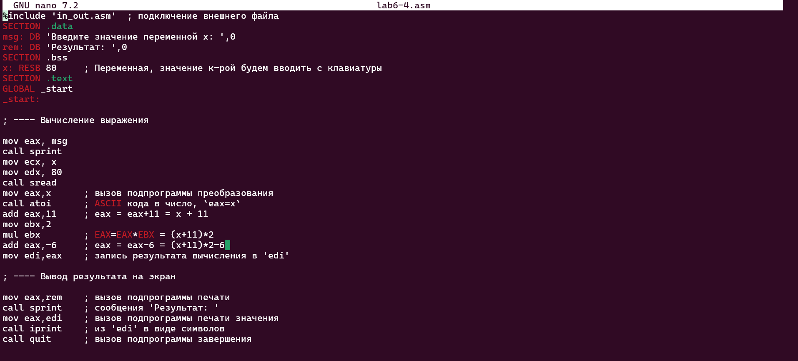

Создаю и запускаю исполняемый файл. При вводе значения 3, вывод - 22.

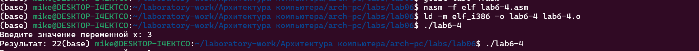

Провожу еще один запуск исполняемого файла для проверки работы программы с другим значением на входе. Программа отработала вернo


# Выводы

При выполнении данной лабораторной работы я освоила арифметические инструкции языка ассемблера NASM.


