# **Лаборатору Отчет No7**

**ДЭВИД МАЙКЛ ФРАНСИС**

# Цель работы

 Изучение команд условного и безусловного переходов.Приобретение навыков написания
 программ с использованием переходов. Знакомство с назначением и структурой файла
 листинга.

# Выполнение лабораторной работы

##  Реализация переходов в NASM

С помощью утилиты mkdir создаю директорию, в которой буду создавать файлы с программами для лабораторной 
работы №7. Перехожу в созданный каталог с помощью утилиты cd.

С помощью утилиты touch создаю файл lab7-1.asm

Открываю созданный файл lab7-1.asm, вставляю в него программу вывода значения регистра eax

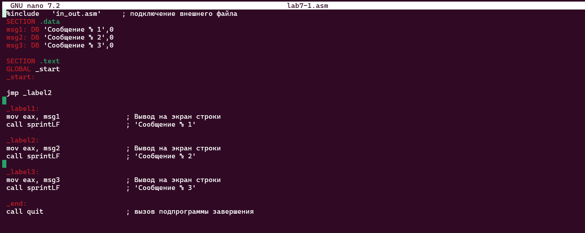

Создаю исполняемый файл программы и запускаю его.


###  Программа с использованием инструкции jmp

Откройте файл lab7-1.asm и добавьте инструкции JMP

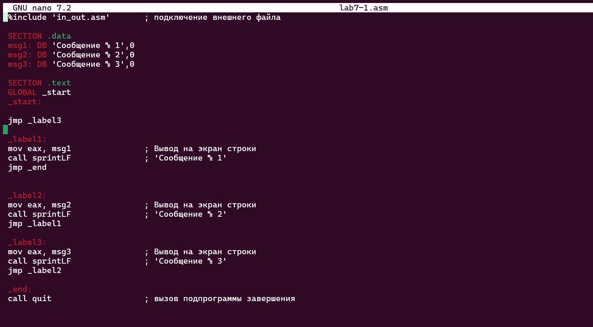

Создаю исполняемый файл программы и запускаю его.

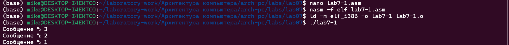

Создаю новый файл lab6-2.asm с помощью утилиты touch.Я ввожу текст другой программы в файл для условного 
jmp

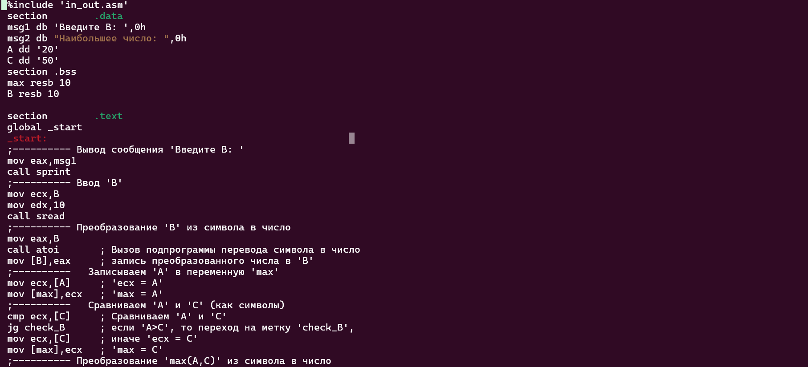
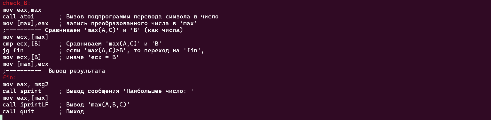

Создаю исполняемый файл программы и запускаю его.

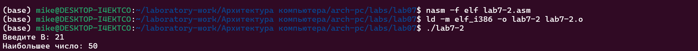

####  Изучение структуры файлы листинга

Я создал файл листинга для файла lab7-2.asm с помощью команды - nasm -f elf -l lab7-2.lst lab7-2.asm
Я открыл файл lab7-2.lst с помощью команды nano lab7-4.lst

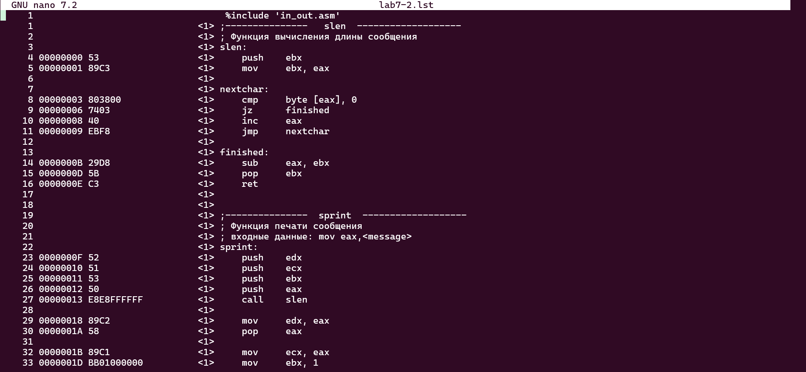

# Ответы на вопросы по программе

1. В строке 5:Эта инструкция сохраняет текущее значение регистра EBX в стек. Обычно это делается, чтобы сохранить значение регистра перед его изменением внутри функции. Машинный код 53 представляет операцию помещения 
значения регистра EBX в стек.

```NASM

00000000 53 push ebx
```

2. В строке 8:Эта инструкция сравнивает значение, хранящееся по адресу памяти, на который указывает регистр EAX, с 0. Если значение равно 0, устанавливается флаг нуля (Zero Flag, ZF) в процессоре, который может использоваться для условий перехода. Машинный код 803800 кодирует операцию сравнения, указывая, что она работает с байтовым значением.

```NASM

00000003 803800 cmp byte [eax], 0
```

3. В строке 14:та инструкция вычитает значение регистра EBX из значения регистра EAX, сохраняя результат в EAX. Эта операция может использоваться, например, для вычисления длины строки, вычитая начальный адрес (EBX) из текущего адреса (EAX). Машинный код 29D8 указывает операцию вычитания (SUB) между регистрами EAX и EBX.

```NASM

0000000B 29D8 sub eax, ebx
```

Когда я удалил операнд из инструкции с двумя операндами и попробовал в файле lab7-4.asm . Когда я попытался создать файл .lst, это не сработало. Я получил ошибки из-за того, что файл стал недействительным

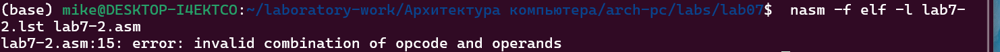

## Выполнение заданий для самостоятельной работы

1. Создаю файл lab7-3.asm с помощью утилиты touch.Открываю созданный файл для редактирования, и написал программу для нахождения наименьшей из трех целочисленных переменных a,b,c. Я выбрал вариант 1

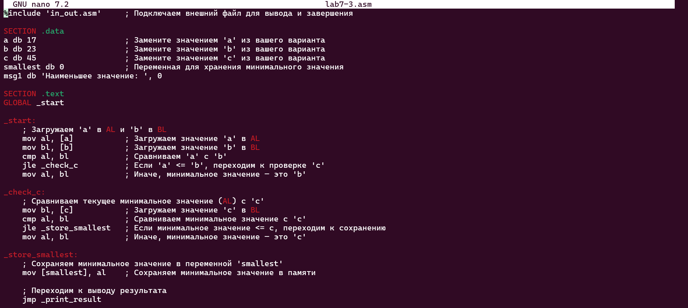


Создаю и запускаю исполняемый файл.Результаты получили 17

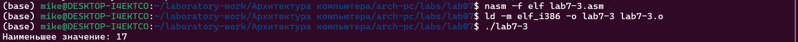

2. Создаю файл lab7-4.asm с помощью утилиты touch.Открываю созданный файл для редактирования,и написал программу, которая для значений x и a, введенных с клавиатуры, вычисляет значение данной функции f(x) и выводит результат вычислений. Я выбрал вариант 1

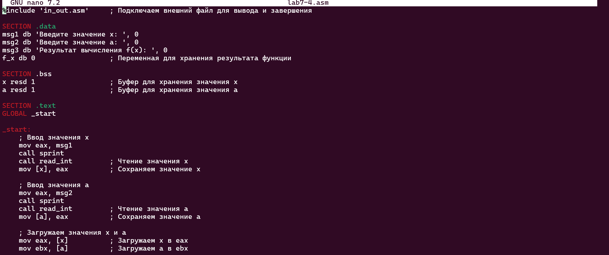
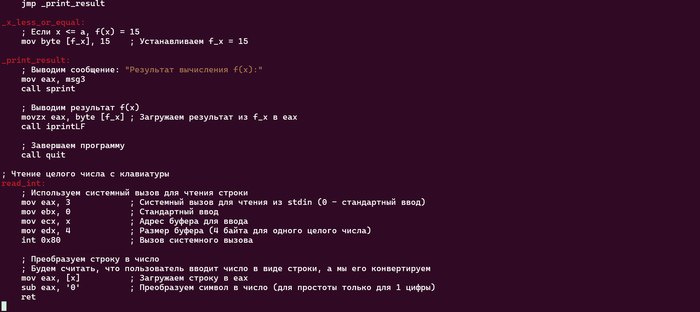

Создаю и запускаю исполняемый файл

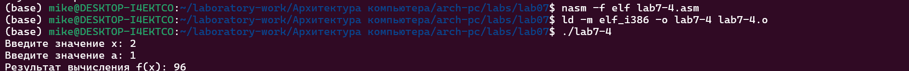

# Выводы

Выполняя эту работу, я научился писать программы с использованием переходов и немного узнал о файле .lst


