# **Лаборатору Отчет No7**

**ДЭВИД МАЙКЛ ФРАНСИС**

# Цель работы

 Приобретение навыков написания программ с использованием циклов и обработкой аргументов командной строки.

# Выполнение лабораторной работы

## Реализация циклов в NASM

С помощью утилиты mkdir создаю директорию, в которой буду создавать файлы с программами для лабораторной 
работы №8. Перехожу в созданный каталог с помощью утилиты cd.

С помощью утилиты touch создаю файл lab8-1.asm

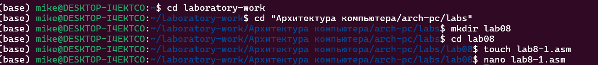

Открываю созданный файл lab8-1.asm, вставляю в него программу вывода значения регистра eax

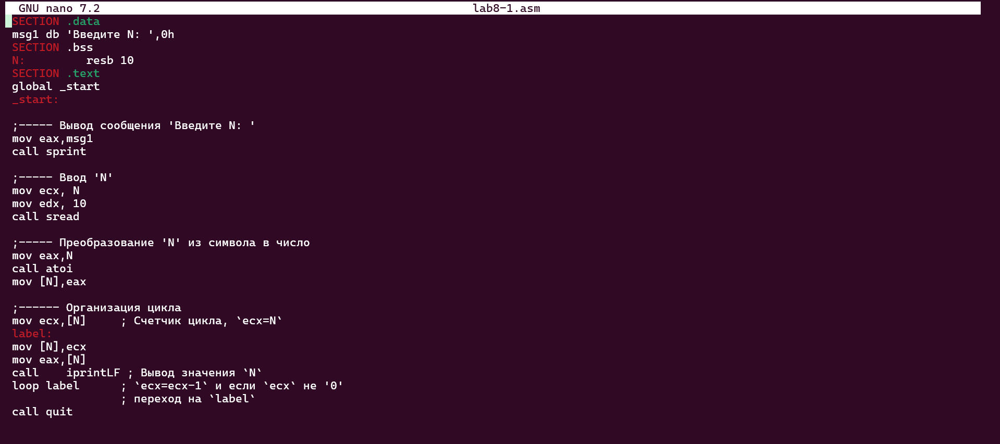

Создаю исполняемый файл программы и запускаю его. Данный пример показывает,что использование регистра ecx в теле цилка loop может
привестикнекорректнойработепрограммы.

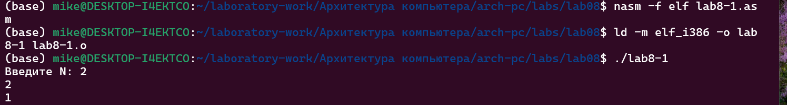

Измените текст программы и внесите изменения в значение регистра ecx в цикле

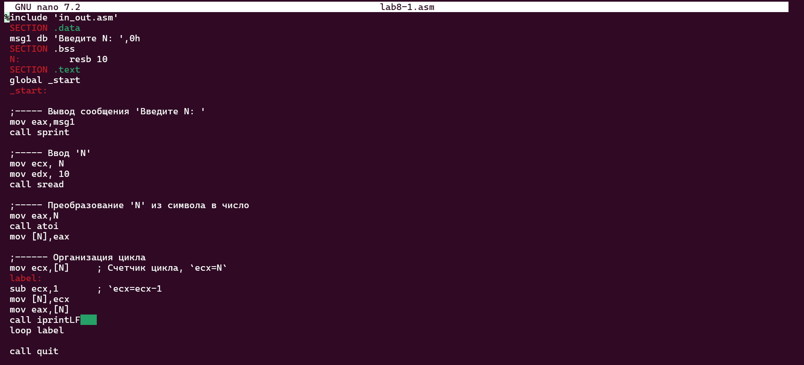

Создаю исполняемый файл программы и запускаю его.Количество проходов цикла не соответствует значению N, введенному с клавиатуры

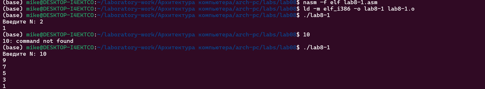

внес изменения в текст программы, добавив команды push и pop для сохранения значения счетчика циклов

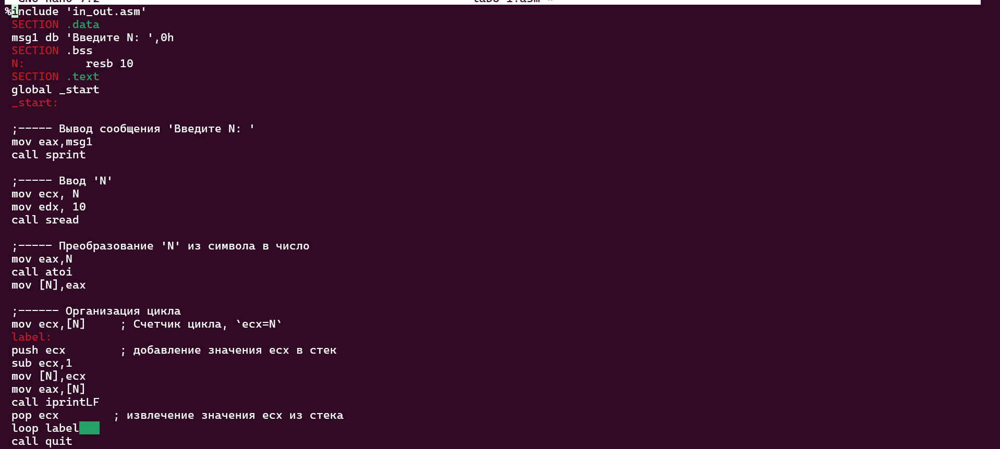

Создаю исполняемый файл программы и запускаю его.Количество проходов цикла соответствует значению N, введенному с клавиатуры

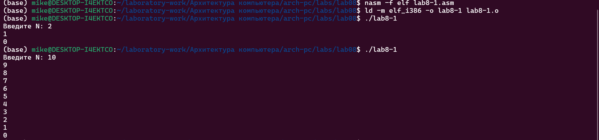

С помощью утилиты touch создаю файл lab8-2.asm. Открываю созданный файл lab8-2.asm, вставляю в него программу вывода значения регистра eax

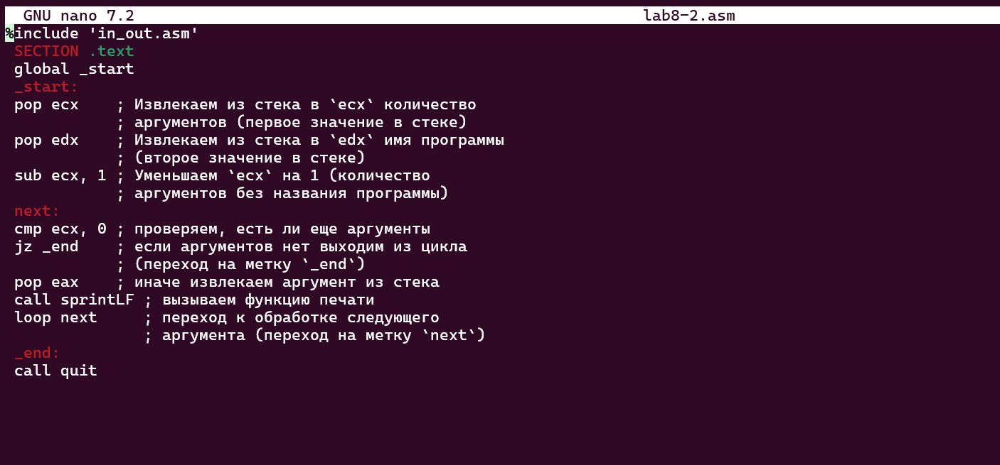

Создаю исполняемый файл программы и запускаю его.Программа обработала три аргумента

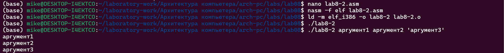

С помощью утилиты touch создаю файл lab8-3.asm. Открываю созданный файл lab8-3.asm, вставляю в него программу вывода значения регистра eax

Создаю исполняемый файл программы и запускаю его.я указал аргументы, а программа добавила сумму аргументов, и результат получился равным 47

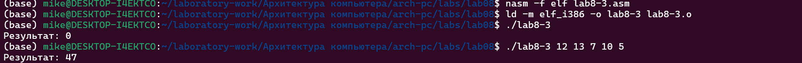

## Выполнение заданий для самостоятельной работы

1. Создаю файл lab8-4.asm с помощью утилиты touch.Открываю созданный файл для редактирования, и написал Написал программу, которая находит сумму значений функции f(x) для 2x + 15(вариант 1)

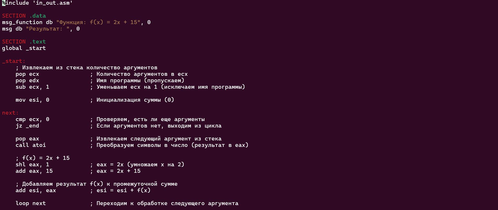
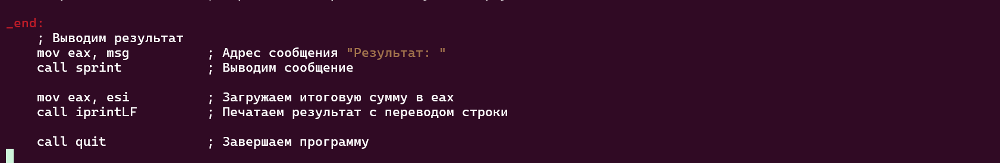

Создаю и запускаю исполняемый файл.Я использовал 1 2 3 4 в качестве x и получил 80

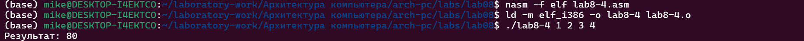

# Выводы

Выполняя эту работу, я научился писать программы, используя циклы и обрабатывая аргументы командной строки

**Ссылка на официальный сайт** [Github](https://github.com/Ushie47/Laboratory-work/tree/main/%D0%90%D1%80%D1%85%D0%B8%D1%82%D0%B5%D0%BA%D1%82%D1%83%D1%80%D0%B0%20%D0%BA%D0%BE%D0%BC%D0%BF%D1%8C%D1%8E%D1%82%D0%B5%D1%80%D0%B0/arch-pc/labs/lab08)
