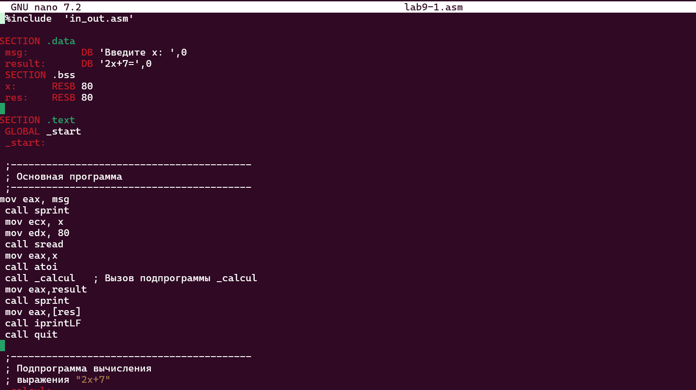

# **Лаборатору Отчет No7**

**ДЭВИД МАЙКЛ ФРАНСИС**

# Цель работы

Приобретение навыков написания программ с использованием подпрограмм. Знакомство
с методами отладки при помощи GDB и его основными возможностями.

# Задание

1. Реализация подпрограмм в NASM
2. Отладка программ с помощью GDB
3. Самостоятельное выполнение заданий по материалам лабораторной работы

# Теоретическое введение

Отладка — это процесс поиска и исправления ошибок в программе. В общем случае его
можно разделить на четыре этапа:


• обнаружение ошибки;
• поиск её местонахождения;
• определение причины ошибки;
• исправление ошибки.


Можно выделить следующие типы ошибок:


• синтаксические ошибки — обнаруживаются во время трансляции исходного кода и
вызваны нарушением ожидаемой формы или структуры языка;
• семантические ошибки — являются логическими и приводят к тому, что программа
запускается, отрабатывает, но не даёт желаемого результата;
• ошибки в процессе выполнения — не обнаруживаются при трансляции и вызывают пре-
рывание выполнения программы (например, это ошибки, связанные с переполнением
или делением на ноль).


Второй этап — поиск местонахождения ошибки. Некоторые ошибки обнаружить доволь-
но трудно. Лучший способ найти место в программе, где находится ошибка, это разбить
программу на части и произвести их отладку отдельно друг от друга.


Третий этап — выяснение причины ошибки. После определения местонахождения ошибки
обычно проще определить причину неправильной работы программы.
Последний этап — исправление ошибки. После этого при повторном запуске программы,
может обнаружиться следующая ошибка, и процесс отладки начнётся заново.

# Выполнение лабораторной работы

## Релазиация подпрограмм в NASM

Создаю каталог для выполнения лабораторной работы №9 (рис. -@fig:001).


Копирую в файл код из листинга, компилирую и запускаю его, данная программа выполняет вычисление функции (рис. -@fig:002).




Изменяю текст программы, добавив в нее подпрограмму, теперь она вычисляет значение функции для выражения f(g(x)) (рис. -@fig:003).


Код программы: 


```NASM
%include 'in_out.asm'

SECTION .data
msg: DB 'Введите x: ', 0
result: DB '2(3x-1)+7=', 0

SECTION .bss
x: RESB 80
res: RESB 80

SECTION .text
GLOBAL _start
_start:
mov eax, msg
call sprint

mov ecx, x
mov edx, 80
call sread

mov eax, x
call atoi

call _calcul

mov eax, result
call sprint
mov eax, [res]
call iprintLF

call quit

_calcul:
push eax
call _subcalcul

mov ebx, 2
mul ebx
add eax, 7

mov [res], eax
pop eax
ret

_subcalcul:
mov ebx, 3
mul ebx
sub eax, 1
ret
```

### Отладка программ с помощью GDB

В созданный файл копирую программу второго листинга, транслирую с созданием файла листинга и отладки, компоную и запускаю в отладчике


Запустив программу командой run, я убедился в том, что она работает исправно


Для более подробного анализа программы добавляю брейкпоинт на метку _start и снова запускаю отладку


Далее смотрю дисассимилированный код программы, перевожу на команд с синтаксисом Intel *амд топчик* .

Различия между синтаксисом ATT и Intel заключаются в порядке операндов (ATT - Операнд источника указан первым. Intel - Операнд назначения указан первым), их размере (ATT - pазмер операндов указывается явно с помощью суффиксов, непосредственные операнды предваряются символом $; Intel - Размер операндов неявно определяется контекстом, как ax, eax, непосредственные операнды пишутся напрямую), именах регистров(ATT - имена регистров предваряются символом %, Intel - имена регистров пишутся без префиксов).


Включаю режим псевдографики для более удобного анализа программы .


### Добавление точек останова

Проверяю в режиме псевдографики, что брейкпоинт сохранился .


Устаналиваю еще одну точку останова по адресу инструкции.


### Работа с данными программы в GDB

Просматриваю содержимое регистров командой info registers.


Смотрю содержимое переменных по имени и по адресу .


Меняю содержимое переменных по имени и по адресу.


Вывожу в различных форматах значение регистра edx.


С помощью команды set меняю содержимое регистра ebx.


### Обработка аргументов командной строки в GDB

Копирую программу из предыдущей лабораторной работы в текущий каталог и и создаю исполняемый файл с файлом листинга и отладки .


Запускаю программу с режиме отладки с указанием аргументов, указываю брейкпопнт и запускаю отладку. Проверяю работу стека, 
изменяя аргумент команды просмотра регистра esp на +4, число обусловлено разрядностью системы, а указатель void занимает как раз 4 байта,
ошибка при аргументе +24 означает, что аргументы на вход программы закончились. (рис. -@fig:017).


## Задание для самостоятельной работы 

1. Меняю программу самостоятельной части предыдущей лабораторной работы с использованием подпрограммы

Код программы:

```NASM
%include 'in_out.asm'

SECTION .data
msg_function db "Функция: f(x) = 2x + 15", 0
msg_input db "Введите x: ", 0
msg_result db "Результат: ", 0

SECTION .bss
res RESB 80
x RESB 80

SECTION .text
global _start

_start:
    mov eax, msg_function
    call sprint
    mov eax, msg_input
    call sprint
    mov ecx, x
    mov edx, 80
    call sread
    mov eax, x
    call atoi
    call _calcul
    mov eax, msg_result
    call sprint
    mov eax, res
    call sprint
    mov eax, [res]
    call iprintLF
    call quit

_calcul:
    push eax
    mov ebx, 2
    mul ebx
    add eax, 15
    mov [res], eax
    pop eax
    ret
```

2. Запускаю программу в режике отладичка и пошагово через si просматриваю изменение значений регистров через i r.
При выполнении инструкции mul ecx можно заметить, что результат умножения записывается в регистр eax, но также меняет и edx. 
Значение регистра ebx не обновляется напрямую, поэтому результат программа неверно подсчитывает функцию


Исправляю найденную ошибку, теперь программа верно считает значение функции.


Код измененной программы: 

```NASM
%include 'in_out.asm'

SECTION .data
div: DB 'Результат: ', 0

SECTION .text
GLOBAL _start
_start:
    mov eax, 3
    add eax, 2
    mov ebx, 4
    mul ebx
    add eax, 5
    mov edi, eax
    mov eax, div
    call sprint
    mov eax, edi
    call iprintLF
    call quit
```

# Выводы

В результате выполнения данной лабораторной работы я приобрел навыки написания программ с использованием подпрограмм, а так же познакомился с методами отладки
при поомщи GDB и его основными возможностями.

# Список литературы


