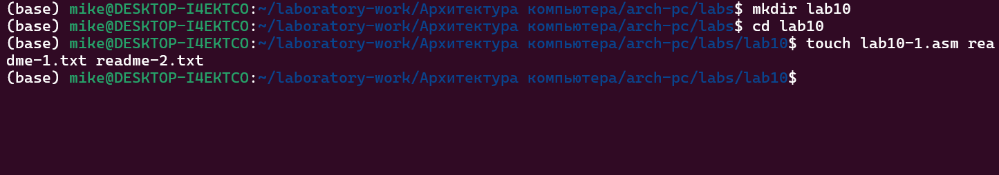
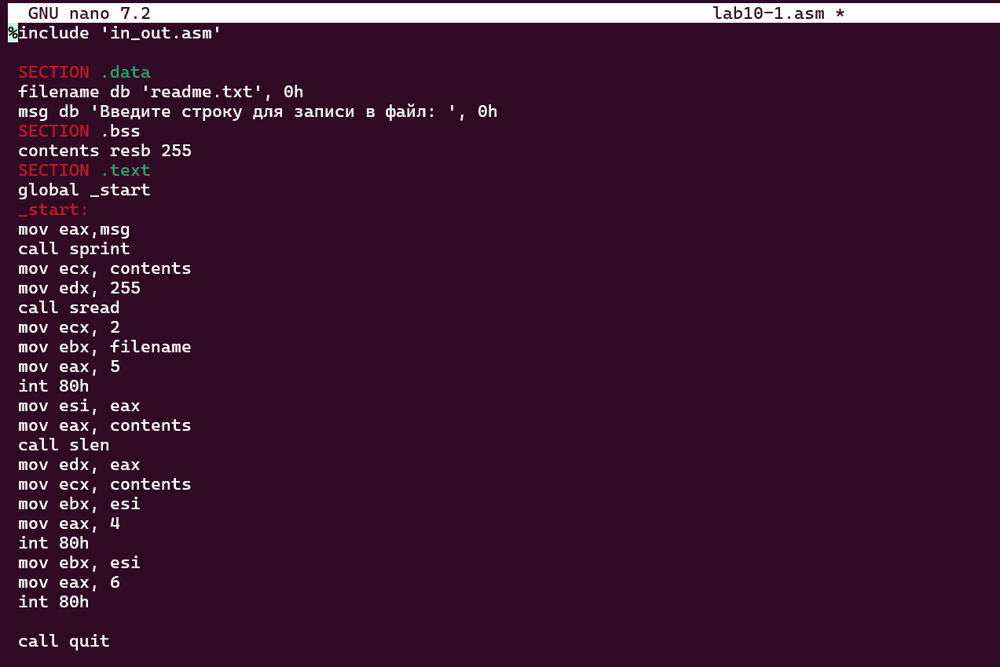
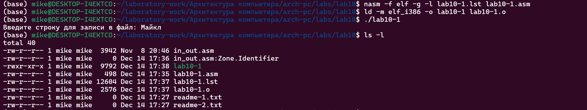
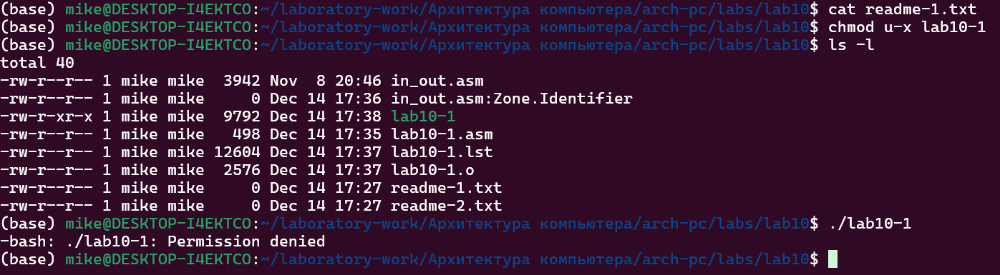

#  **Лаборатору Отчет No10**

**ДЭВИД МАЙКЛ ФРАНСИС**

# Цель работы

Приобретение навыков написания программ для работы с файлами.

# Задание

1. Создание файлов в программах
2. Изменение прав на файлы для разных групп пользователей
3. Выполнение самостоятельных заданий по материалам лабораторной работы.

# Теоретическое введение

ОС GNU/Linux является многопользовательской операционной системой. И для обеспече-
ния защиты данных одного пользователя от действий других пользователей существуют
специальные механизмы разграничения доступа к файлам. Кроме ограничения доступа, дан-
ный механизм позволяет разрешить другим пользователям доступ данным для совместной
работы.

# Выполнение лабораторной работы

Создаю каталог для программ лабораторной работы № 10.



Ввожу в созданный файл программу из первого листинга .



Запускаю программу, она просит на ввод строку, 
после чего создает текстовый файл с введенной пользователем строкой.



Меняю права владельца, запретив исполнять файл, 
после чего система отказывает в исполнении файла, 
т.к. я - владелец - запретил самому себе же исполнять програму.



Добавляю к исходному файлу программы права владельцу на исполнение, исполняемый текстовый файл интерпретирует каждую строку как команду, 
так как ни одна из строк не является командой bash, программа абсолютно ничего не делает.


Согласно своему варианту, мне нужно установить соответсвующие ему права на текстовые файлы, созданные в начале лабораторной работы:

1. В символьном виде для 1-го readme файла -w- --x ---
2. В двоичной системе для 2-го readme файла 110 011 001

Перевожу группу битов в восьмеричную систему, 
символьную запись подгоняю под синтаксис и получаю нужные аргументы для chmod. 


## Задание для самостоятельной работы

Пишу программу, транслириую и компилирую. Программа должна выводить приглашение, 
просить ввод с клавиатуры и создавать текстовый файл с указанной в программе строкой и вводом пользователя.
Запускаю программу, проверяю наличие и содержание созданного текстого файла, программа работает корректно.


Код программы: 

```NASM
%include 'in_out.asm'

SECTION .data
filename db 'name.txt', 0
prompt db 'Как Вас зовут?', 0
intro db 'Меня зовут ', 0

SECTION .bss
name resb 255

SECTION .text
global _start
_start:
mov eax, prompt
call sprint

mov ecx, name
mov edx, 255
call sread

mov eax, 8
mov ebx, filename
mov ecx, 0744o
int 80h

mov esi, eax

mov eax, intro
call slen
mov edx, eax
mov ecx, intro
mov ebx, esi
mov eax, 4
int 80h

mov eax, name
call slen
mov edx, eax
mov ecx, name
mov ebx, esi
mov eax, 4
int 80h

mov ebx, esi
mov eax, 6
int 80h

call quit
```

# Выводы

В процессе выполнения лабораторной работы я прибрел навыки написания программ для работы с файлами, научился редактировать права для файлов.


