# **Лаборатору Отчет No5**

**ДЭВИД МАЙКЛ ФРАНСИС**

## Цель работы
Целью данной лабораторной работы является приобретение практических навыков работы в Midnight Commander, освоение инструкций языка
 ассемблера mov и int.

### **Описание задачи**

Открываю Midnight Commander, введя в терминал mc и Перехожу в каталог ~/work/study/2024-2025/Архитектура Компьютера/arch-pc, используя
файловый менеджер mc и С помощью функциональной клавиши F7 создаю каталог lab05.

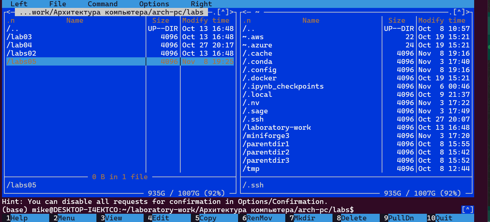

В строке ввода прописываю команду touch lab5-1.asm, чтобы создать файл, в котором буду работать.

#### Структура программы на языке ассемблера NASM

С помощью функциональной клавиши F4 открываю созданный файл для редактирования в редакторе nano.Ввожу в файл код программы для запроса строки
у пользователя.

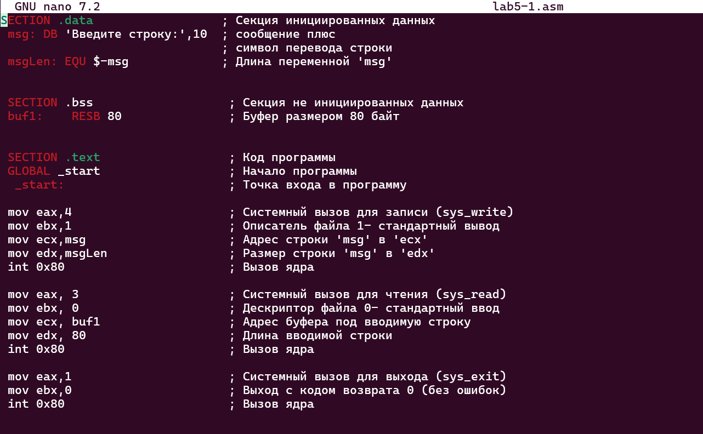

Транслирую текст программы файла в объектный файл командой nasm -f elf lab6-1.asm. Создался объектный файл lab6-1.o. Выполняю компоновку
объектного файла с помощью команды ld -m elf_i386 -o lab5-1 lab5-1.o .
Запускаю исполняемый файл. Программа выводит строку "Введите строку: " и ждет ввода с клавиатуры, я ввожу свои ФИО, на этом программа
заканчивает свою работу.

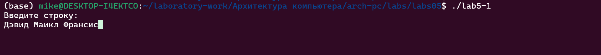

##### Подключение внешнего файла

Скачиваю файл in_out.asm со страницы курса в ТУИС. Он сохранился в каталог "Загрузки"
С помощью функциональной клавиши F5 копирую файл in_out.asm из каталога Загрузки в созданный каталог lab05

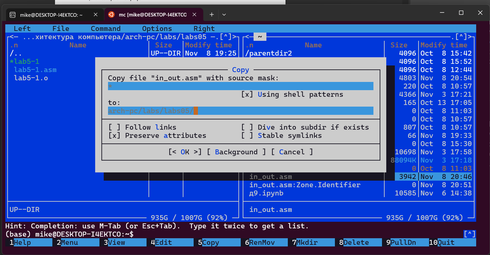

С помощью функциональной клавиши F5 копирую файл lab5-1 в тот же каталог, но с другим именем, для этого в появившемся окне mc прописываю имя
для копии файла.
Изменяю содержимое файла lab5-2.asm во встроенном редакторе nano

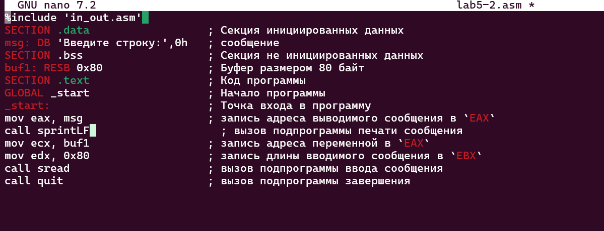

Транслирую текст программы файла в объектный файл командой nasm -f elf lab5-2.asm. Создался объектный файл lab5-2.o. Выполняю компоновку
объектного файла с помощью команды ld -m elf_i386 -o lab6-2 lab5-2.o Создался исполняемый файл lab5-2. Запускаю исполняемый файл

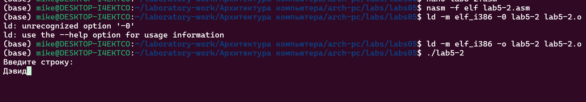

Открываю файл lab5-2.asm для редактирования в nano функциональной клавишей F4. Изменяю в нем подпрограмму sprintLF на sprint. Сохраняю
изменения и открываю файл для просмотра, чтобы проверить сохранение действий

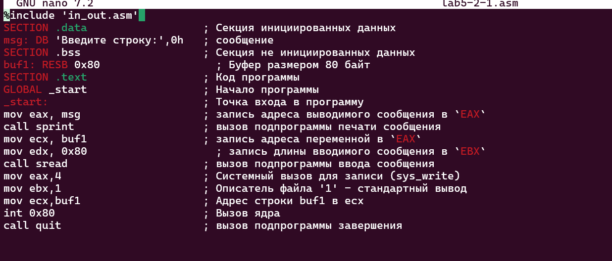

Снова транслирую файл, выполняю компоновку созданного объектного файла, запускаю новый исполняемый файл

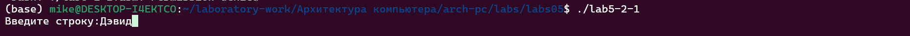

Разница между первым исполняемым файлом lab5-2 и вторым lab5-2-1 в том, что запуск первого запрашивает ввод с новой строки, а программа,
которая исполняется при запуске второго, запрашивает ввод без переноса на новую строку, потому что в этом заключается различие между
подпрограммами sprintLF и sprint.

###### Выполнение заданий для самостоятельной работы

1. Создаю копию файла lab5-1.asm с именем lab5-1-1.asm с помощью функциональной клавиши F5. 
С помощью функциональной клавиши F4 открываю созданный файл для редактирования. Изменяю программу так, чтобы кроме вывода приглашения и 
запроса ввода, она выводила вводимую пользователем строку.

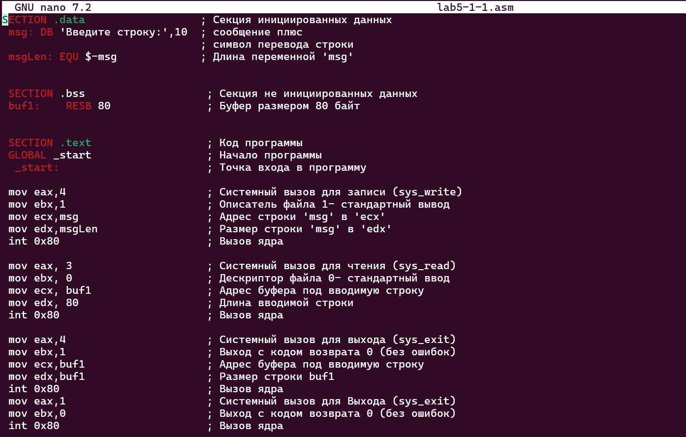

2. Создаю объектный файл lab5-1-1.o, отдаю его на обработку компоновщику, получаю исполняемый файл lab5-1-1, запускаю полученный исполняемый 
файл. Программа запрашивает ввод, ввожу свои ФИО, далее программа выводит введенные мною данные.

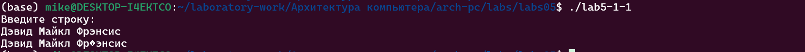

3. Создаю копию файла lab5-2.asm с именем lab5-2-2.asm с помощью функциональной клавиши F5

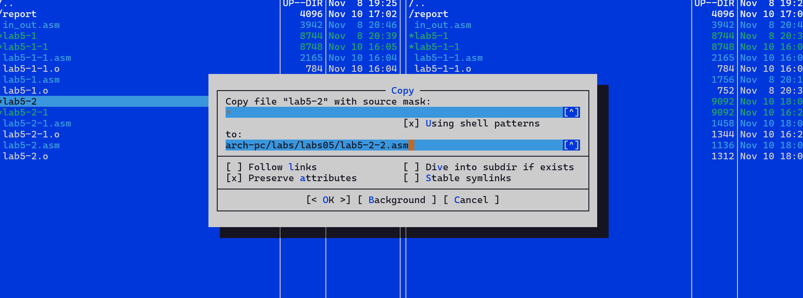

С помощью функциональной клавиши F4 открываю созданный файл для редактирования. Изменяю программу так, чтобы кроме вывода приглашения и 
запроса ввода, она выводила вводимую пользователем строку.

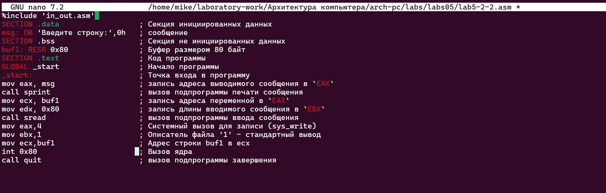

4. Создаю объектный файл lab5-2-2.o, отдаю его на обработку компоновщику, получаю исполняемый файл lab5-2-2, запускаю полученный исполняемый 
файл. Программа запрашивает ввод без переноса на новую строку, ввожу свои ФИО, далее программа выводит введенные мною данные.

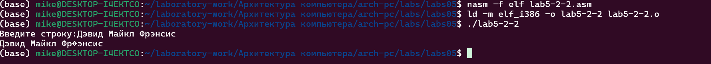

####### Выводы

При выполнении данной лабораторной работы я приобрела практические навыки работы в Midnight Commander, а также освоила инструкции языка 
ассемблера mov и int.
